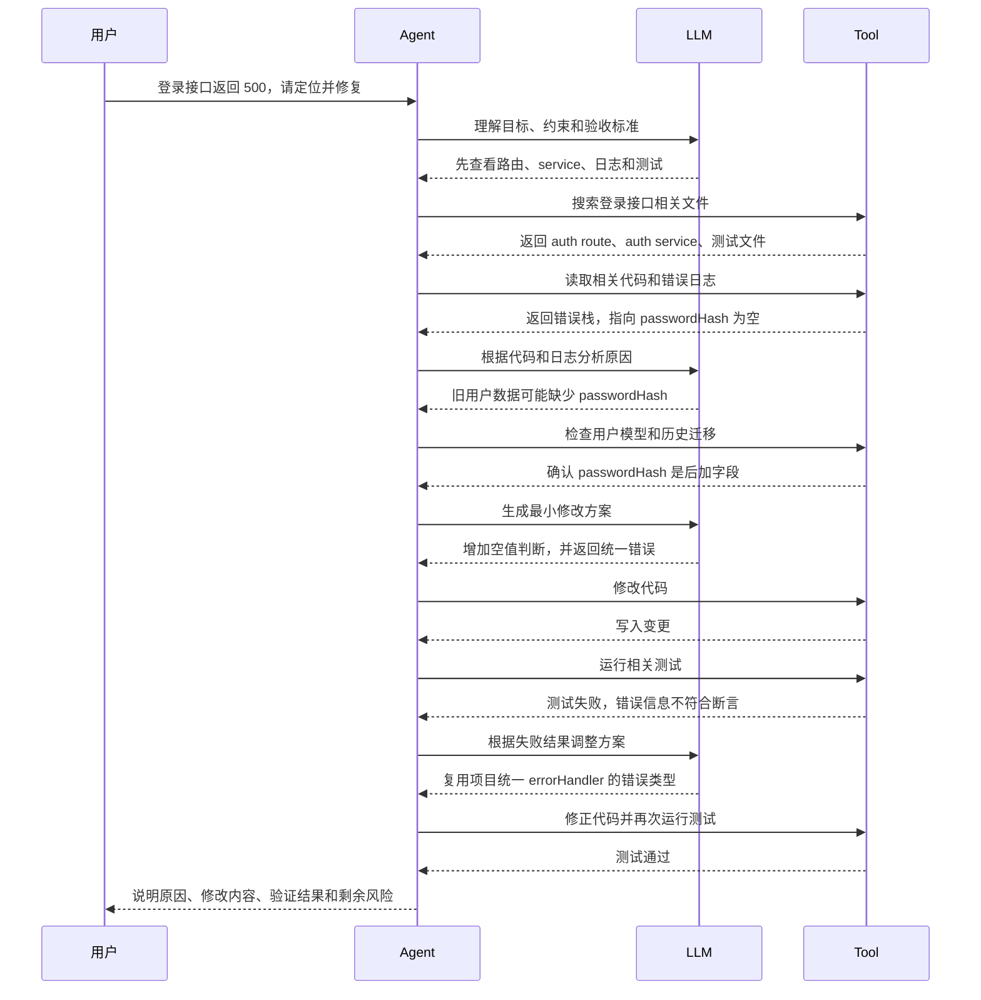

> 经验声明：本文是 AI 编程基础概念系列的第六篇。上一篇讲 MCP，这一篇讲 Agent。Agent 不是一个更酷的名字，而是 AI 从“回答问题”走向“推进任务”的关键形态。

## 先抓住这篇的模型

Agent 可以先理解成：**围绕目标，能自己规划、调用工具、观察结果并继续推进的 AI 工作单元。**

```text
普通问答
  你提问
  AI 回答
  对话结束

Agent 工作
  接收目标
  制定计划
  调用工具
  观察结果
  调整下一步
  直到完成或遇到边界
```

Agent 的重点不是“能不能自动化一切”，而是它开始具备一个任务循环：

| 环节 | Agent 在做什么 |
| --- | --- |
| Goal | 明确这次要完成什么 |
| Plan | 拆出步骤和顺序 |
| Act | 调用 Tool 或 MCP Server 做事 |
| Observe | 读取执行结果、日志、文件变化 |
| Reflect | 判断下一步是继续、修正还是停下 |

如果只记一句话，可以记这一句：**LLM 负责生成和推理，Agent 负责把推理组织成连续行动。**

很多人第一次听到 Agent，会以为它就是“自动帮我干活的 AI”。

这个理解有一部分是对的，但还不够准确。

如果只是模型回答你一句话，那它还只是聊天助手。

如果模型能调用一个工具，比如读取文件或运行测试，那它有了 Tool。

但如果它能围绕一个目标，自己决定先读哪些文件、再跑哪些命令、发现失败后调整方案、最后给出结果，那它才更接近 Agent。

## Agent 不是模型本身

Agent 很容易和 LLM 混在一起。

但它们不是一回事。

```text
LLM 是推理和生成能力。
Agent 是围绕目标组织推理、工具和反馈的运行方式。
```

同一个 LLM，可以被用成普通聊天，也可以被放进 Agent 循环里。

区别在于：它有没有持续推进任务的结构。

比如你问：

```text
这个登录接口为什么报错？
```

普通问答可能会根据你贴出来的错误信息猜原因。

Agent 会更像这样工作：

1. 先确认报错现象和复现方式。
2. 搜索登录接口相关代码。
3. 阅读路由、service、数据库模型和测试。
4. 根据日志提出假设。
5. 修改最小范围代码。
6. 运行测试或复现命令。
7. 如果失败，继续根据结果调整。

这中间每一步都需要 LLM 推理，但整体不只是一次回答。

## 一个更具体的调用案例

只讲“Agent 会规划、会调用工具、会观察结果”还是有点抽象。

可以用一个登录接口报错的例子来看。

用户给 Agent 一个目标：

```text
登录接口现在返回 500，请帮我定位原因并修复。
要求：不要大改认证结构，改完后跑相关测试。
```

普通问答可能会直接给出几个猜测：

- 可能是数据库连接失败。
- 可能是密码校验逻辑有问题。
- 可能是 token 生成失败。

这些猜测不一定错，但它还没有真正进入项目现场。

Agent 的工作更像下面这个时序：



这张图里真正重要的不是“调用了多少工具”，而是 Agent 一直在做一个循环：

```text
理解目标
  ↓
决定下一步需要什么证据
  ↓
调用工具获取证据或执行动作
  ↓
观察结果
  ↓
修正判断
  ↓
继续推进或停止
```

所以更准确的表达不是“Agent 会自动调用工具”，而是：

```text
Agent 会围绕一个目标，持续决定下一步该看什么、做什么、如何根据结果调整。
```

这也是 Agent 和普通聊天最核心的区别。

## Agent 和 Tool 的关系

Tool 是 Agent 能采取的动作。

Agent 是决定什么时候用什么 Tool 的任务循环。

```text
Tool：读文件、搜代码、跑测试、打开浏览器、查数据库
Agent：为了完成目标，选择并编排这些 Tool
```

没有 Tool 的 Agent，很容易停留在“想得很完整，但做不了事”。

只有 Tool、没有 Agent，AI 也可能变成“你让它点哪里，它就点哪里”的遥控器。

真正有用的是二者结合：

- Agent 判断下一步需要什么证据。
- Tool 帮它拿到证据或执行动作。
- Agent 根据结果继续调整计划。

## Agent 和 MCP 的关系

MCP 解决的是工具和外部系统怎么标准化接入。

Agent 解决的是接入之后，AI 怎么围绕目标持续使用这些能力。

可以这么看：

```text
MCP 提供能力入口。
Tool 暴露具体动作。
Agent 编排动作并推进任务。
```

比如一个 AI 编程 Agent 可能会用到：

- 文件系统 MCP，读取项目代码。
- Git MCP，查看 diff 或提交历史。
- 浏览器 MCP，打开页面验证问题。
- 数据库 MCP，检查 schema 或数据。
- 任务系统 MCP，读取需求和回写状态。

这些 MCP Server 本身不等于 Agent。

它们更像 Agent 可以使用的工作现场。

## Agent 为什么对 AI 编程重要

AI 编程和普通问答最大的区别在于：真实任务通常不是一步完成的。

一个 bug 修复可能需要：

- 复现问题。
- 定位模块。
- 阅读调用链。
- 修改代码。
- 跑测试。
- 看失败日志。
- 再次修改。
- 总结变更。

一个需求实现可能需要：

- 理解业务目标。
- 找入口。
- 设计方案。
- 修改前端和后端。
- 补类型和测试。
- 验证页面。
- 输出变更说明。

这些任务天然就是多步骤的。

所以 AI 编程工具如果只停留在“问一句，答一句”，很快就会卡住。

Agent 的价值在于，它把 AI 从一次性回答，推进到连续协作。

## Agent 也需要边界

Agent 听起来很强，但越能行动，越需要边界。

因为它不只是生成文本，还可能真的读文件、改代码、跑命令、访问外部系统。

所以一个可靠的 Agent 至少需要几类约束：

| 约束 | 作用 |
| --- | --- |
| 权限边界 | 哪些文件、系统、命令可以碰 |
| 任务边界 | 这次只解决什么，不顺手扩大范围 |
| 验证边界 | 改完必须如何确认结果 |
| 停止条件 | 什么时候应该停下来问人 |
| 审计记录 | 做过什么、为什么这么做 |

这也是为什么后面还要讲 Rules、Context、Project Map 和 Memory。

Agent 负责推进任务，但它不能替代这些基础设施。

没有 Rules，Agent 可能越努力越容易越界。

没有 Context，Agent 会在错误材料上行动。

没有 Project Map，Agent 不知道先去哪里找。

没有 Memory，Agent 每次都像从零开始。

## Agent 和 Skill 的区别

Agent 和 Skill 也容易混。

可以这样区分：

```text
Agent 是执行任务的工作单元。
Skill 是某类任务的操作手册。
```

Agent 像一个能干活的人。

Skill 像这个人可以翻阅的 SOP。

比如“修复一个线上 bug”这件事：

- Agent 负责接收目标、分析现状、调用工具、推进修改。
- Bug 修复 Skill 告诉 Agent 应该先复现、再定位、再最小修改、最后验证。

所以 Skill 不是 Agent。

Skill 是让 Agent 做事更稳定的方法。

## 总结

Agent 的核心不是“自动化”三个字，而是“围绕目标持续推进”。

可以先记住这几句话：

- LLM 是推理和生成能力。
- Tool 是 AI 可以采取的动作。
- MCP 是外部能力的标准接入方式。
- Agent 是把目标、推理、工具和反馈组织起来的任务循环。
- Agent 越能行动，越需要 Rules、Context、Project Map 和 Memory 提供边界和背景。

下一篇讲 Skill。

如果说 Agent 解决的是“AI 如何持续推进任务”，那么 Skill 解决的是“某一类任务应该按什么方法推进”。

## 上一篇 / 下一篇

- 上一篇：[MCP：工具接入 AI 的标准接口](/blog/2026/03/08/MCP：工具接入AI的标准接口/)
- 下一篇：[Skill：把经验沉淀成操作手册](/blog/2026/03/14/Skill：把经验沉淀成操作手册/)
