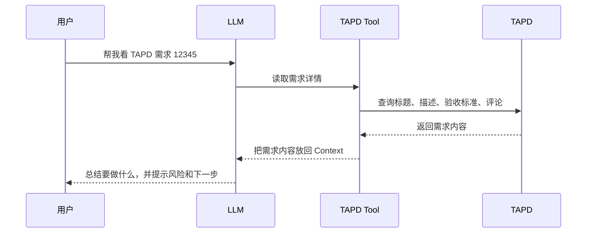

> 经验声明：本文是 AI 编程基础概念系列的第四篇。上一篇讲 Context，这一篇讲 Tool。没有 Tool，AI 更像聊天窗口；有了 Tool，它才开始真正参与工作。

## 先抓住这篇的模型

Tool 解决的是一个很朴素的问题：**AI 不能只靠你复制粘贴材料，它需要能自己观察和操作环境。**

```text
没有 Tool
  你贴代码、贴日志、贴截图
  AI 基于你给的片段回答

有 Tool
  AI 可以读文件、搜代码、跑测试、看日志
  AI 基于真实环境推进任务
```

但 Tool 不是越多越好。真正重要的是：工具能不能帮 AI 补齐当前任务缺失的证据。

| 任务 | 有用的 Tool 能力 |
| --- | --- |
| 修 bug | 搜代码、读文件、跑测试、查看错误日志 |
| 改页面 | 打开浏览器、截图、检查 DOM 或样式 |
| 查数据问题 | 查询数据库、查看 schema、比对数据 |
| 做重构 | 找引用、跑类型检查、跑回归测试 |

单纯的 LLM 只能生成文字。

它不能自己读取你的项目文件，不能运行测试，不能查看浏览器页面，不能查询数据库，也不能知道你电脑里刚刚发生了什么。

但我们现在用的 AI 编程工具，确实可以做这些事。

原因是平台给模型接入了 Tool。

## Tool 是什么

Tool 可以理解成 AI 可以调用的外部能力。

它通常有明确的输入和输出。

比如：

- 搜索代码。
- 读取文件。
- 修改文件。
- 运行终端命令。
- 查询数据库。
- 打开网页。
- 截图浏览器。
- 调用接口。
- 创建 Git commit。

模型本身不是直接拥有这些能力。

它会先判断“我现在需要用哪个工具”，然后由平台执行对应动作，再把结果返回给模型。

模型再根据这些结果继续推理。

## 没有 Tool 时，AI 只能靠你贴材料

假设你问：

```text
帮我看一下 TAPD 里这个需求，下步应该怎么做？
```

如果没有 Tool，AI 只能看你手动贴出来的需求内容。

你没贴，它就不知道。

你贴少了，它只能猜。

你贴错了，它会被误导。

有 Tool 之后，流程会变成：

1. AI 判断需要读取 TAPD 需求。
2. 平台调用 TAPD Tool。
3. Tool 返回需求标题、描述、验收标准和评论。
4. AI 把这些内容放进 Context。
5. AI 根据需求整理重点和风险。
6. AI 给出下一步开发建议。

这时 AI 就不只是“回答问题”，而是在参与一个真实的工程循环。

用一个更具体的例子看，会更直观。

假设你对 AI 说：

```text
帮我看一下 TAPD 需求 12345，整理一下要做什么。
```

如果 AI 有访问 TAPD 的 Tool，它的工作过程大概会像这样：



这张图里要注意两点。

第一，真正访问 TAPD 的不是 LLM 本身，而是外部 Tool。

第二，Tool 执行完之后，会把结果再放回 Context，LLM 才能继续判断下一步。

## Tool 是 AI 的手和眼睛

可以这样理解：

```text
LLM 是脑子。
Context 是摆在脑子面前的材料。
Tool 是 AI 可以伸出去的手和眼睛。
```

眼睛负责看：

- 看文件。
- 看网页。
- 看日志。
- 看测试结果。
- 看数据库返回。

手负责做：

- 改代码。
- 跑命令。
- 调接口。
- 生成文件。
- 提交变更。

没有 Tool，AI 只能基于已有上下文推理。

有了 Tool，AI 才能主动获取新信息，并且通过执行结果修正自己的判断。

## Tool 不是 Skill

Tool 和 Skill 很容易混。

Tool 是能力。

Skill 是流程。

比如：

- 能运行测试，这是 Tool。
- 知道修 bug 时要先复现、再定位、再最小修改、最后验证，这是 Skill。

再比如：

- 能访问 TAPD，这是 Tool。
- 知道如何读取任务、分析需求、改代码、回写状态，这是一套 Skill。

所以 Tool 解决的是“能不能做”。

Skill 解决的是“应该怎么做”。

这两个要配合起来，AI 编程才会稳。

## Tool 也需要权限边界

Tool 越强，风险也越高。

如果 AI 能读文件，就要考虑哪些文件可以读，哪些文件包含敏感信息。

如果 AI 能运行命令，就要考虑哪些命令是安全的，哪些命令可能删除数据、覆盖文件或泄露凭证。

如果 AI 能访问业务系统，就要考虑权限、审计和操作确认。

所以好的 AI 编程环境，不只是给模型很多工具。

它还会设计清楚：

- 工具能做什么。
- 工具不能做什么。
- 哪些操作需要确认。
- 哪些数据不能暴露。
- 执行结果如何返回给模型。

AI 能干活是一件好事，但工程系统里永远不能只看能力，也要看边界。

## 总结

Tool 让 LLM 从“只会说”，变成“能观察、能执行、能验证”。

可以先记住这几句话：

- Tool 是 AI 可以调用的外部能力。
- 没有 Tool，AI 只能依赖你贴给它的材料。
- 有了 Tool，AI 可以读取文件、运行测试、搜索代码和调用系统。
- Tool 是能力，Skill 是流程。
- Tool 越强，越需要权限和安全边界。

下一篇讲 MCP。

当工具越来越多时，一个新问题会出现：不同工具怎么用统一方式接入 AI？

这就是 MCP 要解决的问题。

## 上一篇 / 下一篇

- 上一篇：[Context：模型当前能看到什么](/blog/2026/03/01/Context：模型当前能看到什么/)
- 下一篇：[MCP：工具接入 AI 的标准接口](/blog/2026/03/08/MCP：工具接入AI的标准接口/)
